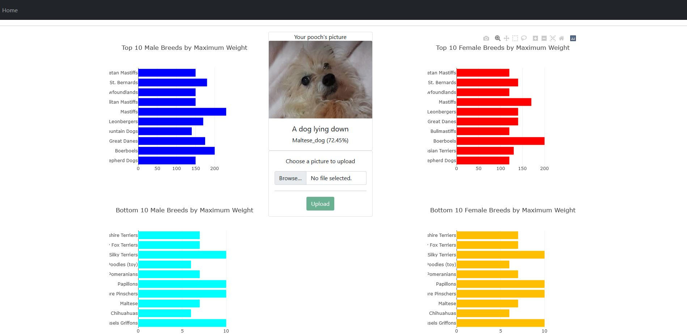

# All about that pooch

## Overview of the Project
An website all about dogs. Users can upload an image of their favourite dog the website will guess what breed it is, as well as recieve a caption for the uploaded image. The website also contains interesting on information dog weights (in pounds) which has been scrapped from the [American Kennal Club website](https://www.akc.org/expert-advice/nutrition/breed-weight-chart/).

### Key Website Features
- **Image Caption Generator**
  - A feature which allows an image to be uploaded to an AWS s3 bucket and then read and analysed by the pretrained Azure ComputerVision model from [Microsoft Computer Vision](https://azure.microsoft.com/en-us/services/cognitive-services/computer-vision/) which returns an image caption for it.
- **Image Classifier**
  - A feature which allows an image to be uploaded to an AWS s3 bucket and then read and analysed by the Tensorflow pretrained ResNet50 model which returns a breed of the dog in the uploaded image, as well as the probability of it being that breed.
- **Graphs of the top and bottom ten dog breeds by sex**
  - Graphs created made using Plotly.js using data scraped from the [American Kennal Club website](https://www.akc.org/expert-advice/nutrition/breed-weight-chart/) using Beautiful Soup and Pandas.

Visit the website and try it for yourself at https://allaboutthatpooch.herokuapp.com/

 

## Tools/Packages used
- HMTL5
- CSS
- Javascript
  - Bootstrap
  - D3
  - Plotly
- Python
  - Beautiful soup
  - Pandas
  - Keras
  - Tensorflow
  - Flask
  - Jinja2
- AWS
  - S3
- Azure
  - Microsoft Cognitive Services/Computer Vision
- Heroku

 

## How to use
- Visit the [website](https://allaboutthatpooch.herokuapp.com/).
- Alternative you can clone the website and deploy it locally.
  - Clone and download the package.
  - Create an env file add create a key for [azure](https://docs.microsoft.com/en-us/azure/virtual-machines/ssh-keys-portal) `AZURE_KEY` (for the `captions_generator.py` file) and and an access key `AWS_ACCESS_KEY` and a secret key `AWS_SECRET_KEY` for [amazon](https://aws.amazon.com/premiumsupport/knowledge-center/create-access-key/) (for the `app.py` file).
  - Create a bucket in S3 following these [instructions](https://docs.aws.amazon.com/AmazonS3/latest/userguide/create-bucket-overview.html) and change the `BUCKET_NAME` and `BUCKET_PATH` variables in the `app.py` file on lines 75 and 76 respectively.
  - Create a managed instance in Azure by following these [instructions](https://docs.microsoft.com/en-us/azure/azure-sql/managed-instance/instance-create-quickstart) and replace the `endpoint` variable on line 8 in the `captions_generator.py` file.
  - Open Git Bash and run `flask run`.
